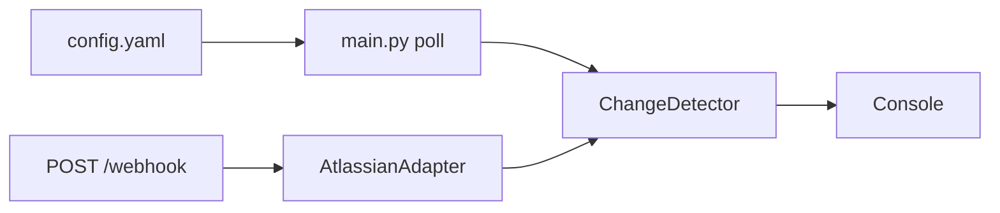

# statusPageLogs

Monitor status pages (e.g. OpenAI, GitHub); detect new incidents and print to console.

## Approach

- **Provider adapters** — one adapter per provider (Atlassian today), add pages via config, add providers via one new adapter.
- **Pull + optional push** — polling for all, webhook server for instant updates where supported.
- **Unified pipeline** — same detector and formatter for polling and webhooks; console output only.



## Start server

```bash
pip install -r requirements.txt
```

- **Polling:** `python main.py` (runs until Ctrl+C).
- **Webhook receiver:** `python webhook_server.py` — listens on http://localhost:8000/webhook.

## Test

1. **Polling:** Run `python main.py`. You should see `[OpenAI] No new events.` (and GitHub) each cycle.
2. **Webhook:** Start `python webhook_server.py`, then
```
curl -X POST http://localhost:8000/webhook -H "Content-Type: application/json" -d '{"page":{"id":"t"},"incident":{"id":"i1","name":"Test","incident_updates":[{"id":"u1","body":"Test","status":"investigating","created_at":"2025-11-03T14:32:00Z"}]}}'
```

The formatted event appears in the server terminal; curl returns `OK`.

## Why this approach?

**Why polling here is not bad.** Status pages change rarely: incidents are occasional, and updates are human-paced (every few minutes at most). Polling every 30 seconds is more than enough to catch updates quickly without hammering the API. We use async I/O so one process can poll dozens of targets concurrently with minimal CPU; at 100 pages and a 30s interval we do about three requests per second in total. The Atlassian adapter also uses conditional requests (If-Modified-Since): when nothing has changed the server returns 304 and no body, so we use almost no bandwidth when pages are quiet. So polling is cheap, simple to deploy (no public URL or firewall rules), and works for every provider—including those with no webhook support.

**Benefits of the hybrid approach.** Combining polling with an optional webhook server gives the best of both. Webhooks provide near-instant notifications when a provider supports them: as soon as an incident is created or updated, we get a POST and can process it immediately. That reduces time-to-notification from “up to one poll interval” to seconds. Not all status pages offer webhooks, and delivery can be best-effort (if our server is down we miss events). Polling acts as a fallback: we still scrape on a schedule, so we eventually see any update we might have missed. The same pipeline (change detector and formatter) handles both sources, so we avoid duplicate logic and guarantee consistent output whether an event came from a scrape or a webhook. We can run polling-only when we want zero operational overhead, or run both when we want low latency and resilience. Adding more pages or providers stays config- and adapter-driven, so the design scales without turning polling into a bottleneck.
